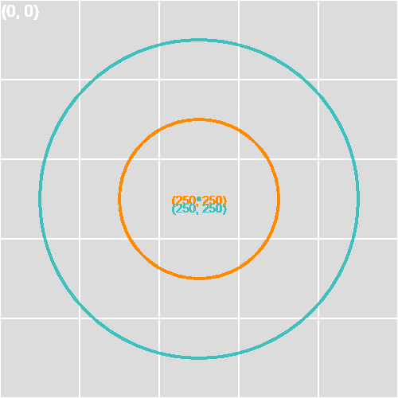

# p5js_scripts
These are the ones I ve been playing with at the p5.js editor, so are stored here as backup (sorts of).  
A p5.js script can be made as a React component, but here they are as html + css + js

How to try these p5.js scripts:

1. Clone the repo (or download the files).
2. Edit the index.html where it requires the script, at the HTML script tag.
3. Edit the drawCircle() function, or add new functions.
4. Open the index.html in a web browser, or in VSCode you can use Live Server on localhost.
5. Press the S key in your keyboard to run the save() function to prompt a file download of a rendered canvas image.

At the moment is only 1 script, but I will be adding more.

This one is [grid-helper-refactored.js](scripts/grid-helper-refactored.js).  
Renders a canvas background, and over it draws a grid.  
The drawCircle() function takes parameters, and will draw a circle over the grid.

  

